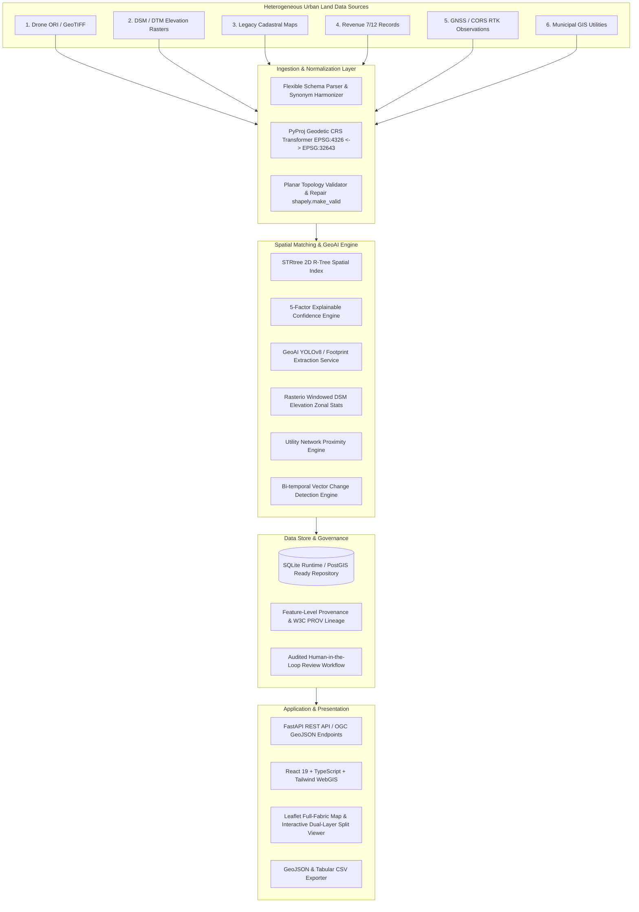

# ULAG Architecture Overview
**Problem Statement 26013:** Automated Integration and Intelligent Harmonization of Multi-source Geospatial Data for Urban Land Record Management

---

## 1. System Topology

ULAG uses a modular, cloud-ready, hackathon-deployable architecture designed for high-precision geospatial data fusion:

---

## 2. Core Subsystems

### 2.1 Coordinate Reference System (CRS) Transformation Pipeline
- **Engine:** `pyproj.Transformer` with `always_xy=True`.
- **Supported Datums:** WGS84 Geodetic (`EPSG:4326`), UTM Zone 43N (`EPSG:32643`), and national Indian grids (`EPSG:7755`).
- **Metric Conversion:** Metric distances and areas are rigorously evaluated in projected planar coordinate spaces to prevent latitude-dependent distortions.

### 2.2 Intelligent Schema Harmonization
- **Synonym Dictionary:** Maps arbitrary column naming conventions (e.g. `khasra_no`, `survey_number`, `SurveyNo`, `Plot_ID`) to canonical fields.
- **Dynamic Tolerance:** Flexible parsing without hardcoded column index dependencies.

### 2.3 5-Factor Explainable Confidence Scoring
Confidence scores are computed without hardcoding or heuristics overrides:
1. **Geometry Similarity ($w=0.35$):** Intersection-over-Union (IoU) between legacy and drone/reconciled polygons.
2. **Area Consistency ($w=0.20$):** Normalized area difference percentage.
3. **Centroid Proximity ($w=0.20$):** Euclidean distance between boundary centroids.
4. **Attribute Match ($w=0.15$):** Normalized survey number and tenure classification alignment.
5. **Proximity Score ($w=0.10$):** Spatial neighborhood buffer containment.

$$\text{Confidence} = 0.35 \cdot S_{\text{geom}} + 0.20 \cdot S_{\text{area}} + 0.20 \cdot S_{\text{centroid}} + 0.15 \cdot S_{\text{attr}} + 0.10 \cdot S_{\text{prox}}$$

### 2.4 GeoAI Building Extraction Pipeline
- Pre-trained GeoAI model registry (YOLOv8-Urban, ResNet50 Classifier, Random Forest land-use).
- Structural footprint extraction with polygonization, centroid positioning, and area extraction.

### 2.5 Rasterio Elevation Engine (DSM/DTM)
- Direct GeoTIFF pixel array reads via Rasterio.
- Computes minimum elevation, maximum elevation, mean elevation, and estimated slope for individual parcel polygons.

### 2.6 Full-Fabric WebGIS
- Background layer loads the complete 300-parcel boundary fabric.
- Real-time hover inspection and click-to-select interaction.
- Interactive split slider comparing historical cadastral with drone ORI and AI building footprints.
